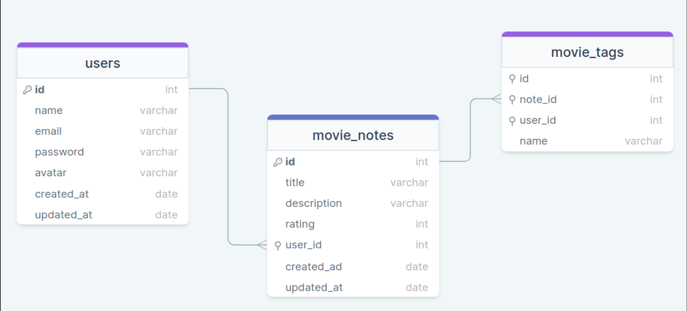

<h1 align="center">🎥 Favorite Movies🎬 </h1>

  <a href="#-tecnologias">Tecnologias</a>&nbsp;&nbsp;&nbsp;|&nbsp;&nbsp;&nbsp;
  <a href="#-projeto">Projeto</a>&nbsp;&nbsp;&nbsp; &nbsp;&nbsp;&nbsp;

 

  

## 🚀 Tecnologias

Esse projeto foi desenvolvido com as seguintes tecnologias:
- SGBD
- Beekeeper Studio
- Insominia
- NodeJS
- Express.js
- Métodos de requisição HTTP
- Nodemon
- SQL
- SQLite
- Comandos DDL
- CRUD SQL
- Migrations
- BCrypt
- Query Builder

## 💻 Projeto

O projeto proposto envolve a criação de uma aplicação em Node.js onde os usuários podem cadastrar filmes, preenchendo informações como nome, descrição e nota, além de criar tags relacionadas a cada filme. O banco de dados terá três tabelas principais: users para armazenar informações do usuário, movie_notes para registrar anotações sobre filmes e movie_tags para armazenar as tags relacionadas aos filmes.

A estrutura do banco de dados é definida pelos seguintes campos: 

1. Tabela de Usuários (users):

- id: Identificador único do usuário
- nome do usuário
- e-mail do usuário
- senha do usuário (com criptografia)
- data de criação
- data de edição

2. Tabela de Anotações de um Filme (movie_notes):

- id: Identificador único da anotação
- título do filme
- descrição do filme
- nota que o usuário deu para o filme (valor de 1 a 5)
- id do usuário (referência à tabela de usuários)
- data de criação
- data de edição

3. Tabela de Tags (movie_tags):

- id: Identificador único da tag
- nome da tag
- id da anotação a qual a tag está relacionada (referência à tabela de anotações)
- data de criação

=> Observações importantes para o desenvolvimento do projeto incluem:

- Implementar a exclusão em cascata para garantir que as tags sejam removidas caso o usuário opte por excluir uma anotação.
- Utilizar criptografia para armazenar as senhas dos usuários de forma segura.
- Realizar validação de e-mails para garantir dados válidos e consistentes no cadastro de usuários.

